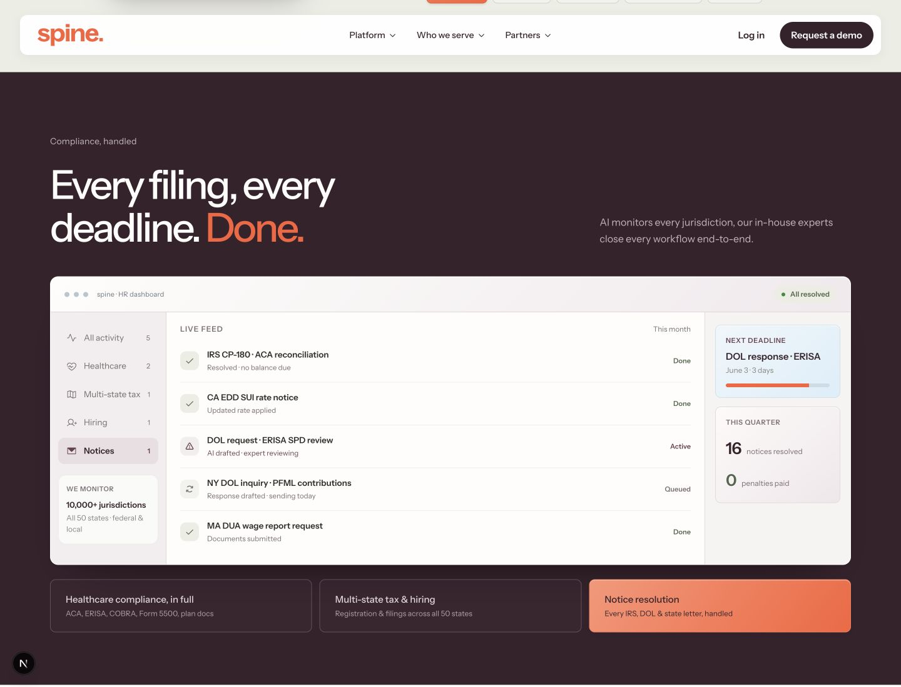

# Ana sayfa görsel düzenlemeleri — çalışma ve devir notu

Güncelleme: 30 Eylül 2026

Bu belge `codex/visual-tweaks` branch'indeki çalışmayı başka bir bilgisayarda, sohbet geçmişine veya Dropbox dosyalarına ihtiyaç duymadan sürdürmek için hazırlanmıştır. Branch, `main` üzerindeki `484b39d` commit'inden açıldı. Kullanıcı bu çalışmanın dokümantasyonuyla birlikte remote'a gönderilmesini istedi; ana branch'e birleştirme istenmedi.

## Kapsam ve kullanıcı kararları

- Çalışma mevcut Spine web sitesinin **yalnız ana sayfasını (`/`)** kapsıyor. Tasarım son hâline geldikten sonra tüm sisteme yayılması değerlendirilecek.
- Amaç, AI üretimi hissini güçlendiren tekrarlı tasarım kalıplarını azaltıp mevcut sitenin kalitesini yükseltmek.
- Kullanıcı ilk turu “fena gözükmüyor” diye değerlendirdi; ayrıntılı incelemesi devam edecek. Bu, fontun, yerleşimin veya tüm tasarımın nihai onayı değildir.
- Daha modern bir sans font denenmesi istendi. Manrope ve Satoshi örnekti; zorunlu seçim değildi. Bu branch'te Instrument Sans kullanıldı.
- Animasyonlu ürün ekranlarının UX'i korunarak UI, tipografi, buton ve yüzey kalitesi iyileştirildi.
- Kullanıcının verdiği renk referansına çok yakın, ancak birebir aynı olmayan HEX değerleri uygulandı.
- **Son renk kararı:** Parlak sarı-yeşil/asit sarı kullanılmayacak. Palet değişkeni ve açık türevleri kaldırıldı; bütün kullanımları mevcut turuncuya çevrildi. Soluk adaçayı yüzeyleri ve durum bildiren sakin yeşil bu kaldırma isteğinin kapsamı değildi.
- Mevcut logo geometrisi korundu. Ayrı `spine-web-v2`, branding ve video işleri bu branch'in kapsamı değil.

## Neler değişti?

### Genel görünüm ve sayfa düzeni

İlk incelemede tekrarlanan pill başlıkları, iç içe kartlar, dekoratif ikonlar, büyük yuvarlak bölüm çerçeveleri, pastel kelime vurguları ve yoğun demo etiketleri öne çıktı. Bunların ağırlığı azaltıldı; daha açık kompozisyonlar, hafif başlıklar, ince ayırıcılar ve bölümlere göre farklı düzenler kuruldu.

| Alan | Bu branch'teki görünüm |
| --- | --- |
| Hero | Mevcut başlık ve etiket animasyonu; Instrument Sans, yeni tipografik ölçüler, bordo/turuncu renkleri |
| Kanıt alanı | Sabit müşteri logoları ve sade 3-in-1 / 24/7 / $0 bilgileri |
| İşveren benefits | Açık iki sütun, metin listesi ve buz mavisi çevrede çalışan plan ekranı |
| Çalışan benefits / Heal | Açık adaçayı zemin, sade telefon UI'ı ve turuncu seçili ajan kontrolleri |
| Compliance | Tam genişlik bordo zemin, açık ürün penceresi, turuncu “Done” ve seçili kontroller |
| People Ops | Mevcut Slack demosu ve yanında dört süreç satırı |
| Ücret | Turuncu tam genişlik alan, $0 ve ücret modelinin açıklaması |
| HR topluluğu | Tipografik hizmet listesi |
| Karşılaştırma | Masaüstünde sade tablo; mobilde özellik bazında karşılaştırma |
| Header / kapanış / footer | Ana sayfanın yeni font, yüzey ve renkleriyle uyumlu görünüm |

Instrument Sans değişken fontu repo içinde barındırılıyor; font için ayrı indirme veya servis anahtarı gerekmiyor. Logo kendi SVG çizimini kullanmaya devam ediyor. Font dosyası ve SIL OFL lisansı `public/fonts/instrument-sans/` altında.

Önceki ana sayfadaki yüzde iddiaları tutarsız olduğundan ayrı %25 kartı kullanılmadı; benefits açıklamasındaki mevcut %15 metni korundu. Pazarlama iddiaları bu tasarım çalışmasında bağımsız doğrulanmadı.

### Animasyonlu ürün ekranları

- **Plan optimizer:** Pencere çerçevesi, araç çubuğu, kart yüzeyleri ve yazı hiyerarşisi inceltildi. Dekoratif Map/LIVE etiketleri gizlendi. Headcount/contribution sliderları ve öneri hesabı korundu. Balanced etiketi yakın noktalarla çakışmayı azaltmak için noktanın yanına alındı.
- **Heal:** Ana sayfadaki 3D karakter, video PIP'i ve ajan avatarları kaldırıldı. Beş ajan, konuşmalar, manuel seçim ve otomatik geçiş davranışı korundu. Mesajlar, composer, gönderim kontrolü ve seçeneklere daha incelikli yüzeyler uygulandı.
- **Compliance:** Ürün penceresi, araç çubuğu, yan paneller ve seçim kartları güncellendi. İçerik, kategori seçimi ve animasyon akışı aynı. Turuncu seçili kart üzerindeki küçük açıklama, okunaklılık için tam opak bordo.
- **Slack:** Çerçeve ve tipografi iyileştirildi; Slack'in tanınabilir iç renkleri, mesaj sırası ve uzman satırı korundu.

Ekranlar statik görsellerle değiştirilmedi; mevcut React/GSAP demoları çalışıyor. Hafif gradyan, iç ışık, kenarlık ve ölçülü cam etkileri CSS ile uygulanıyor.

### Hero boyut değişimi düzeltmesi

İnceleme sırasında masaüstü/mobil boyut değişiminde React'in yeniden oluşturduğu etiket ızgarasının fizik sistemince yeniden ölçülmediği görüldü. `refreshLayout()` bağlantısı eklendi; böylece animasyon sistemi yeni DOM düğümlerini tekrar ölçüyor. Açılış koreografisi korunuyor.

## Güncel renk sistemi

Ana renk değişkenleri [HomepageTheme.module.css](../components/home/HomepageTheme.module.css) içinde. Bunlar yalnız ana sayfa kapsamına uygulanır.

| Değişken | Değer | Kullanım |
| --- | --- | --- |
| `--home-orange` | `#FC6039` | Logo, CTA, hero/duyuru/“Done” vurguları, seçili kontroller, ücret alanı |
| `--home-plum` | `#38222C` | Başlık, ana metin, koyu bölüm ve footer zeminleri |
| `--home-sage` | `#B2BBA5` | Heal yüzey ailesi ve ikincil grafik noktaları |
| `--home-ice` | `#DBEEFA` | Plan sunumu ve deadline kartı |
| `--home-paper` | `#FEFDFB` | Ana açık zemin ve ürün yüzeyleri |
| `--home-copy` | `#71656A` | İkincil metin |
| `--home-line` | `#DED8D6` | İnce ayırıcılar |
| `--home-sage-wash` | `#EBEEE5` | Geniş Heal zemini |
| `--home-ice-wash` | `#F0F7FB` | Açık mavi panel yüzeyleri |
| `--home-warm-wash` | `#F3EFEB` | Sıcak nötr yüzeyler |
| `--home-success` | `#52664A` | Başarı/tamamlanma durumları |

Eski `--home-citron` kaldırılmıştır; tekrar eklenmemeli. Seçili Heal kontrolü `#FC7958 → #FC6039`, compliance kartı `#FF9475 → #FC6039` geçişini kullanır. Son turda “New” ve “Done” da turuncuya döndü.

Kontrol edilen ana kontrastlar: bordo/turuncu **4,79:1**, gövde metni/kırık beyaz **5,48:1**, gövde metni/açık Heal zemini **4,74:1**. Turuncu/kırık beyaz **3,01:1**; bu eşleşme büyük hero yazısında kullanılıyor. Bu değerler kapsamlı bir erişilebilirlik denetiminin yerine geçmez.

## Kodda nereden devam edilmeli?

| Dosya / alan | Sorumluluğu |
| --- | --- |
| [HomePage.tsx](../components/home/HomePage.tsx) | Ana sayfanın yeni bölüm sırası, içeriği ve bileşimi |
| [HomePage.module.css](../components/home/HomePage.module.css) | Bölüm düzenleri, boşluklar ve responsive davranış |
| [HomepageTheme.tsx](../components/home/HomepageTheme.tsx) | Yerel Instrument Sans ve `usePathname() === "/"` ile tema sınırı |
| [HomepageTheme.module.css](../components/home/HomepageTheme.module.css) | Renk değişkenleri, ürün ekranlarının ve site çerçevesinin ana sayfaya özgü stilleri |
| `app/(site)/page.tsx`, `app/(site)/layout.tsx` | Yeni sayfanın ve tema sarmalayıcısının bağlanması |
| `components/sections/platform/` | Paylaşılan ürün bileşenleri; çoğunlukla `data-*` stil kancaları eklendi |
| `components/header/`, `components/footer/TagDrop.tsx` | Ana sayfa temasının eriştiği stil kancaları |
| `components/hero/Hero.tsx`, `lib/hero/useHeroScene.ts`, `lib/hero/HeroRestController.ts` | Responsive etiket ızgarasının yeniden ölçülmesi |
| [Instrument Sans lisansı](../public/fonts/instrument-sans/OFL.txt) | Repo ile taşınan fontun lisansı |

Paylaşılan `EmployeeBenefits` ve `Compliance` bileşenlerinde `refined` varsayılan olarak `false`; `AgentPhone.showCharacter` ve `AgentRail.showAvatars` varsayılan olarak `true`. Ana sayfa yeni görünümü açıkça seçiyor; iç sayfalar eski sunumu koruyor. Yeni stilleri global CSS'e taşımadan önce kullanıcıdan tüm sisteme yayma yönlendirmesi gelmeli.

Balanced etiketinin yan yerleşiminde `--tw-translate-x: 0px` mevcut Tailwind merkezlemesini sıfırlar. Bunu yalnız `translate: none` ile değiştirmek bu projedeki CSS derlemesinde aynı sonucu vermedi.

## Diğer bilgisayarda devam

Önce repo `AGENTS.md` dosyasını ve bu belgeyi oku. Yeni uygulama kodu yazmadan önce, AGENTS.md gereği kurulu Next.js rehberinin ilgili bölümüne `node_modules/next/dist/docs/` içinden bak.

Depo o bilgisayarda yoksa:

```bash
git clone --branch codex/visual-tweaks https://github.com/osmankoycu/spine-web.git
cd spine-web
```

Depo zaten varsa, önce o bilgisayardaki yerel değişiklikleri koru; sonra:

```bash
git fetch origin
git switch codex/visual-tweaks
git pull --ff-only origin codex/visual-tweaks
```

Yerel branch henüz yoksa `git switch` tek eşleşen remote branch'i takip ederek oluşturur. Birden fazla remote nedeniyle belirsizlik olursa `git switch --track origin/codex/visual-tweaks` kullan.

Bu bilgisayarda Node **25.9.0**, npm **11.12.1** ile çalışıldı. Kurulu Next.js 16.2.9'un Node gereksinimi `>=20.9.0`; bağımlılıkları mevcut lockfile üzerinden kur:

```bash
npm ci
npm run dev -- --hostname 127.0.0.1 --port 3010
```

Önizleme: [http://localhost:3010/](http://localhost:3010/).

Ortam ayarları git ile taşınmaz. Gerekirse `.env.example` temel alınarak `.env.local` oluştur; mevcut dosya varsa üzerine yazma. Sanity blog/üretim derlemesi için projenin `NEXT_PUBLIC_SANITY_PROJECT_ID` ve `NEXT_PUBLIC_SANITY_DATASET` ayarlarını güvenli kaynaktan edin. Gerçek form e-postası, Calendly ve Slack entegrasyonları için ilgili ortam ayarları ayrıca gerekir. Anahtarları veya `.env.local` dosyasını commit etme. Bu görsel turda gerçek form gönderimi yapılmadı.

## Doğrulama kaydı ve sınırları

30 Eylül 2026'da uygulama sırasında:

- V01 ve palet v02 için `npm run build` başarılı; 65 sayfa üretildi. `tsc --noEmit` geçti.
- Değişen TS/TSX dosyalarında ESLint hatası yoktu; mevcut AgentPhone kullanılmayan eslint-disable ve AgentRail img uyarıları sürüyor. Sanity default-export deprecation ve localstorage ortam uyarıları build'i engellemedi.
- 1280×720, 1440×1000 masaüstü; 390×844 ve 375×667 mobil görünümler incelendi. Yatay sayfa taşması görülmedi.
- Plan sliderları, Heal Care Finder/FightBack ve compliance kategori seçimleri içerik/durum değiştiriyor. Slack mesaj ve uzman sırası açılıyor.
- Mobil menü, demo modal aç/kapat ve hero resize kontrol edildi; gerçek form gönderilmedi.
- `/platform/plan-optimization` bağlantısıyla iç sayfaya geçildi: ana sayfa teması uygulanmıyor ve Schibsted Grotesk korunuyor. Geri dönüşte yeni tema tekrar etkinleşiyor.
- Son sarı-yeşil kaldırma turu CSS ile sınırlıydı. 1440×1100 masaüstünde Notice resolution ve 390×844 mobilde FightBack seçimi doğrulandı; turuncu renkler doğru, konsol hata/uyarı kaydı boş, yatay taşma yok. Bu küçük renk değişikliğinden sonra build tekrarlanmadı.
- `git diff --check` temiz.

Bu kontrol fiziksel telefon testi veya bütün sitenin kapsamlı regresyon/erişilebilirlik testi değildir. Sonraki kod değişikliğine göre ilgili kontrolleri tekrar et; görsel bir değişiklikte ana sayfa ve en az bir iç sayfanın tema izolasyonunu koru.

## Son görünüm

Görseller son turuncu güncellemesinin gerçek uygulama ekranlarıdır; bu branch ile taşınır.



[Mobil Heal görünümü](images/homepage-visual-tweaks/heal-mobile.png): seçili FightBack kontrolü ve aşağıdaki “Done” vurgusu turuncudur.

## Sonraki adım

Kullanıcı mevcut sayfayı inceleyip yeni yönlendirme verecek. Aynı branch üzerinden bu geri bildirimleri uygula. Instrument Sans ve yeni bölüm düzenleri hâlâ değerlendirme aşamasında; parlak sarı-yeşilin kullanılmaması ise açık kullanıcı kararı. Ana sayfa son hâline gelmeden temayı iç sayfalara yayma. Branch'i remote'a taşımak, `main` ile birleştirme veya üretim yayını onayı değildir.
